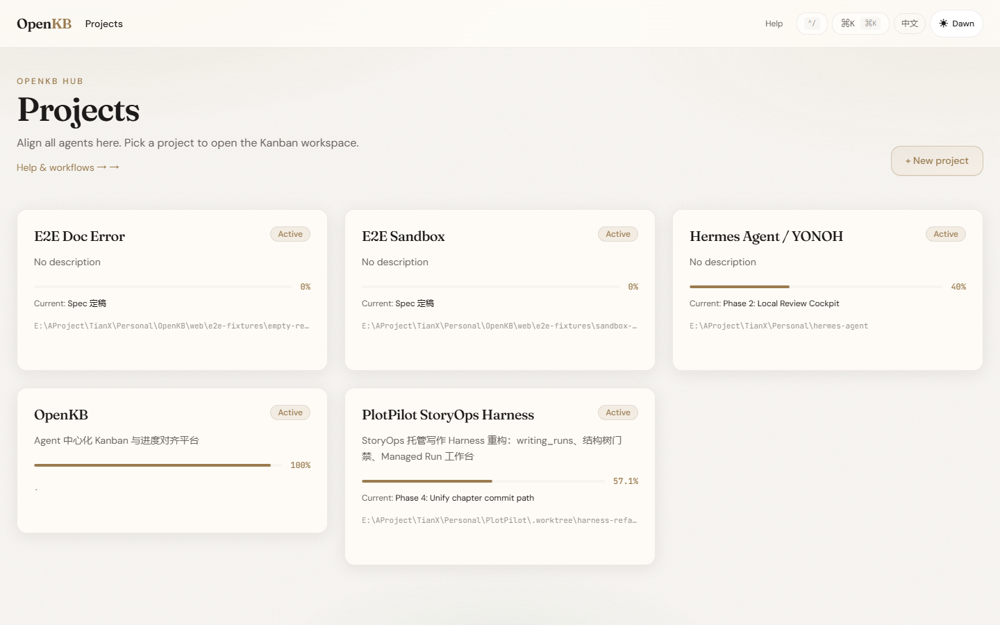
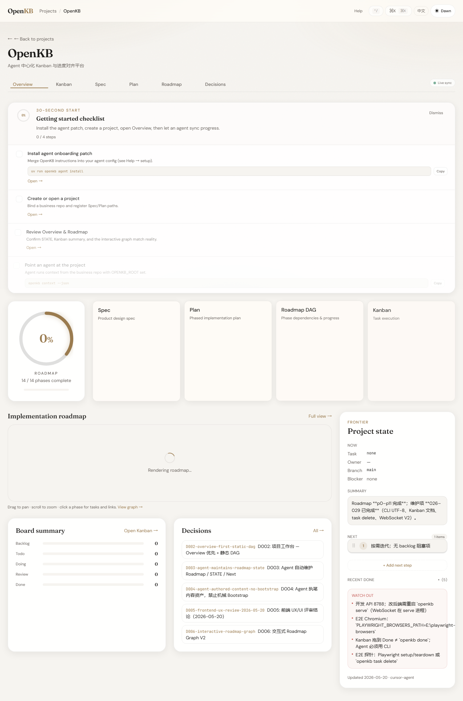
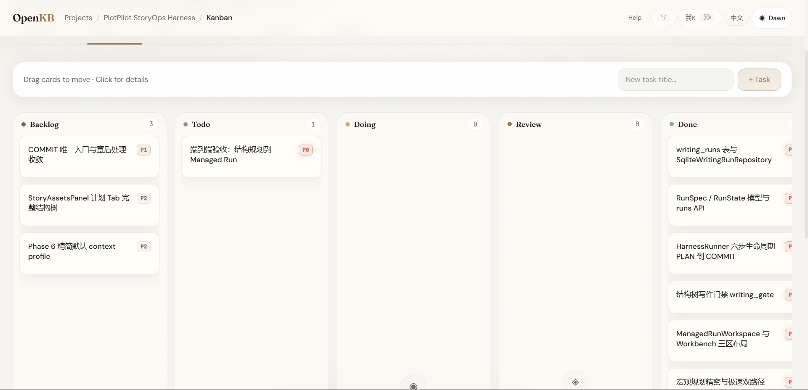

# OpenKB

**Agent 用 CLI 对齐进度，人类在 Web Hub 阅读 Spec / Plan / 路线图。**

Centralized **Agent Kanban + project state hub**：Coding Agent 通过 CLI 对齐进度；人类在 Web UI 管理 Spec / Plan / 决策。

数据在 `workspace/projects/{slug}/`，而不是在每个业务仓库里散落 `.openkb/`。

> **为什么选 OpenKB？** [docs/WHY_OPENKB.zh-CN.md](docs/WHY_OPENKB.zh-CN.md) · **贡献指南：** [CONTRIBUTING.zh-CN.md](CONTRIBUTING.zh-CN.md) · **部署文档：** [docs/DEPLOYMENT.zh-CN.md](docs/DEPLOYMENT.zh-CN.md) · **English:** [README.md](README.md) · **宣传页:** [godiao.github.io/openkb](https://godiao.github.io/openkb/)

<p align="center">
  
</p>

<p align="center">
  
  
</p>

> 自行录制演示：[docs/DEMO.md](docs/DEMO.md) · `cd web && npm run demo:capture`

---

## Installation (cross-platform)

Run commands from the **OpenKB root**. Prefer `uv run openkb` (no Windows-only scripts required).

### 1. Dependencies

```bash
cd /path/to/OpenKB
export UV_CACHE_DIR="${UV_CACHE_DIR:-$HOME/.cache/uv}"   # optional

uv sync --extra dev

cd web
npm install
npm run build
```

### 2. Environment variables

| Variable | Required | Description |
|----------|----------|-------------|
| `OPENKB_ROOT` | Yes | Absolute path to OpenKB root |
| `OPENKB_AGENT_ID` | Yes | Agent identity (locks, audit) |
| `UV_CACHE_DIR` | Recommended | uv cache directory |
| `OPENKB_PROJECT` | No | Force project slug |

**Linux / macOS:**

```bash
export OPENKB_ROOT="/path/to/OpenKB"
export OPENKB_AGENT_ID="your-agent-name"
export UV_CACHE_DIR="$HOME/.cache/uv"
```

**Windows (PowerShell, current session):**

```powershell
$env:OPENKB_ROOT = "E:/path/to/OpenKB"
$env:OPENKB_AGENT_ID = "your-agent-name"
$env:UV_CACHE_DIR = "E:/uv-cache"
```

**Windows (optional):** user-level env via `.\scripts\setup-openkb-env.ps1` (env + PATH only).

See [`.env.example`](.env.example).

### 3. Agent config patch (recommended, one-time)

Merge OpenKB session entry into your coding agent’s `AGENTS.md` / `CLAUDE.md`. **Not written into business repos.**

```bash
uv run openkb agent scan
uv run openkb agent install              # interactive
uv run openkb agent install --all -y     # all available targets
uv run openkb agent status
uv run openkb agent uninstall --all -y   # remove patch blocks
```

Spec: [`agent/PATCH_FORMAT.md`](agent/PATCH_FORMAT.md) · Chinese: [`agent/PATCH_FORMAT.zh-CN.md`](agent/PATCH_FORMAT.zh-CN.md)

Agent workflow skill: [`skill/openkb-sync/SKILL.md`](skill/openkb-sync/SKILL.md) · Chinese: [`skill/openkb-sync/SKILL.zh-CN.md`](skill/openkb-sync/SKILL.zh-CN.md)

### 4. 启动 Hub

**开发**（热更新）：

```bash
# 终端 1 — API
uv run openkb serve --port 8788

# 终端 2 — Web UI
cd web && npm run dev
# → http://127.0.0.1:5173
```

**生产**（单进程 — API 托管 `web/dist`）：

```bash
cd web && npm run build
uv run openkb serve --port 8788
# → http://127.0.0.1:8788
```

**Docker：**

```bash
docker compose up --build
```

详见 [UPGRADE.md](UPGRADE.md) · [SECURITY.md](SECURITY.md) · [CHANGELOG.md](CHANGELOG.md)。

### 5. 验证

```bash
uv run openkb --help
uv run openkb context --json
uv run pytest
```

---

## Agent CLI (common)

```bash
uv run openkb context --json
uv run openkb status --json
uv run openkb next --json

uv run openkb project create --slug my-app --name "My App" \
  --repo-path /path/to/my-app --link --json

uv run openkb project link --slug my-app   # inside business repo
```

On Windows, if `scripts/` is on PATH, you may use `openkb.cmd` instead of `uv run openkb`.

---

## Web UI

- `/` — 项目列表
- `/help` — 帮助与工作流（双语说明）
- `/projects/:slug` — 总览 / 看板 / Spec / Plan / 路线图 / 决策

UI 支持 **English / 中文**（顶栏语言切换）。

### E2E（Playwright）

使用独立项目 **`e2e-sandbox`**，不污染 dogfood 看板 `openkb`。CI： [`.github/workflows/ci.yml`](.github/workflows/ci.yml)。

```powershell
$env:OPENKB_ROOT = "E:/path/to/OpenKB"
$env:PLAYWRIGHT_BROWSERS_PATH = "E:/playwright-browsers"
cd web
npm run test:e2e
```

Windows 推荐 **`uv run openkb`**（UTF-8 安全）。

---

## 安全说明 ⚠️

OpenKB **1.x 无登录鉴权**，仅适合 **本机或可信内网**。

| ✅ 可以 | ❌ 不要 |
|--------|--------|
| 本机 `127.0.0.1` | 在公网 VPS 上裸奔 `0.0.0.0:8788` |
| 局域网 / VPN / 私有 Docker | 无鉴权情况下当 SaaS 宣传 |

见 [SECURITY.md](SECURITY.md) · [docs/WHY_OPENKB.zh-CN.md](docs/WHY_OPENKB.zh-CN.md)

---

## Windows 速查

| 项 | 建议 |
|----|------|
| CLI | `uv run openkb …` |
| 缓存 | `UV_CACHE_DIR=E:/uv-cache` |
| E2E 浏览器 | `PLAYWRIGHT_BROWSERS_PATH=E:/playwright-browsers` |

---

## Architecture decisions

See `workspace/projects/openkb/decisions/`.
