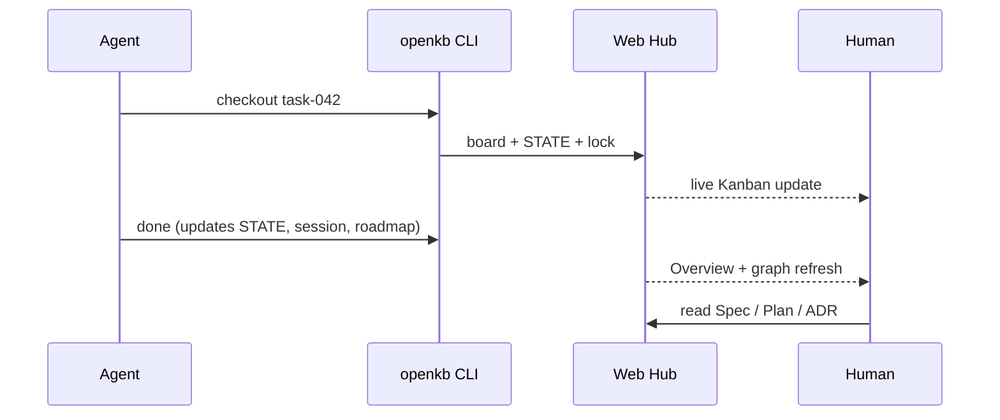

# Why OpenKB?

**One line:** Agents align progress via CLI; humans read Spec, Plan, and the roadmap in the Web Hub.

OpenKB is a **centralized Agent Kanban + project state hub**. Task files, `STATE.md`, roadmap, and ADRs live under one `workspace/` — not scattered `.openkb/` folders in every business repo.

- **English:** this file  
- **中文：** [WHY_OPENKB.zh-CN.md](WHY_OPENKB.zh-CN.md)

---

## 30-second pitch

You run coding agents (Claude Code, Cursor, Codex, …). They need a **single place** to:

1. **Check out** work (`openkb checkout`) with locks and audit  
2. **Finish** work (`openkb done`) — update Kanban, STATE, session log, roadmap  
3. Let **humans** review Spec / Plan / decisions in a polished UI with live sync  

OpenKB is that place. Business code stays in `{repo_path}`; hub metadata stays in `OPENKB_ROOT/workspace/projects/{slug}/`.

---

## How OpenKB compares

| | **OpenKB** | **Linear / Jira** | **Pure Markdown in git** | **`.openkb/` per repo** |
|---|------------|-------------------|--------------------------|-------------------------|
| **Built for coding agents** | ✅ CLI-first workflow | ❌ Human PM tools | ⚠️ Manual files | ⚠️ Ad-hoc |
| **Kanban + STATE + roadmap + ADR** | ✅ One hub | ⚠️ Needs plugins | ⚠️ You design layout | ⚠️ Per-repo drift |
| **Live UI sync from CLI** | ✅ WebSocket watch | ✅ Cloud SaaS | ❌ Refresh manually | ❌ DIY |
| **Spec / Plan in business repo** | ✅ `repo_path` + Hub reader | ❌ Separate docs | ✅ Native git | ⚠️ Split brains |
| **Self-host / air-gap** | ✅ `uv` + Docker | ❌ Vendor cloud | ✅ Git only | ✅ If you build it |
| **Auth / multi-tenant SaaS** | ❌ v1 — trusted network | ✅ | N/A | N/A |

**Choose OpenKB when:** you already use agent CLIs, want Kanban + STATE + roadmap aligned automatically, and can run a **private** Hub on localhost or LAN.

**Choose something else when:** you need enterprise PM (OKRs, sprints, billing) or a **public internet** multi-user deployment without adding your own auth layer.

---

## Typical workflow



---

## Demo & screenshots

| Asset | How to generate |
|-------|-----------------|
| **Screenshots** | `cd web && npm run demo:capture` → `docs/assets/demo/*.png` |
| **GIF / video** | Follow [DEMO.md](DEMO.md) — 60s script (Kanban drag → CLI `done` → Roadmap) |

After capture, add `docs/assets/demo/hub-demo.gif` and link from the README.

---

## Security (read before you share)

OpenKB **1.x has no authentication**. Safe defaults:

| ✅ OK | ❌ Do not |
|-------|-----------|
| `127.0.0.1` on your machine | Expose `:8788` on `0.0.0.0` to the public internet |
| LAN / VPN / Docker on private host | Treat as multi-tenant SaaS |
| Reverse proxy + TLS + auth (you add) | Assume “open source = safe on VPS” |

Full threat model: [SECURITY.md](../SECURITY.md)

---

## Get started

```bash
git clone https://github.com/GoDiao/openkb.git
cd openkb
uv sync --dev && cd web && npm ci && npm run build
export OPENKB_ROOT="$(pwd)" OPENKB_AGENT_ID="my-agent"
uv run openkb serve --port 8788
# → http://127.0.0.1:8788
```

See [README.md](../README.md) · [CONTRIBUTING.md](../CONTRIBUTING.md)
